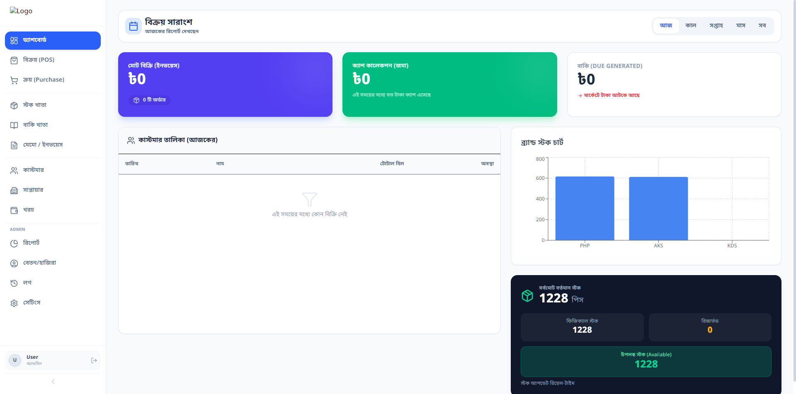
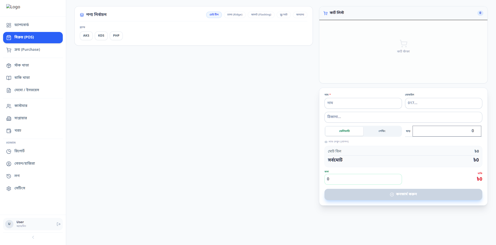
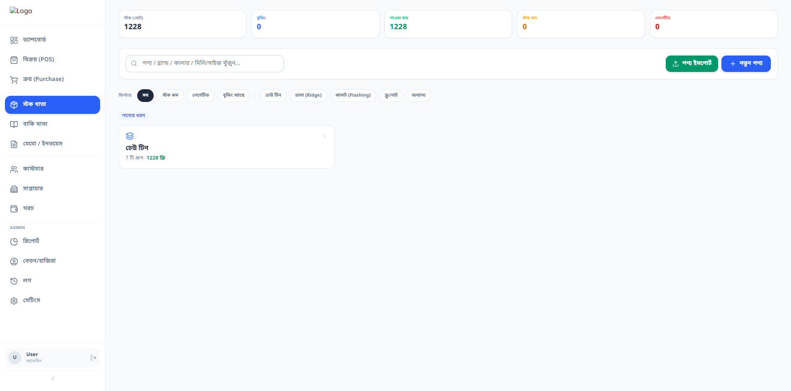
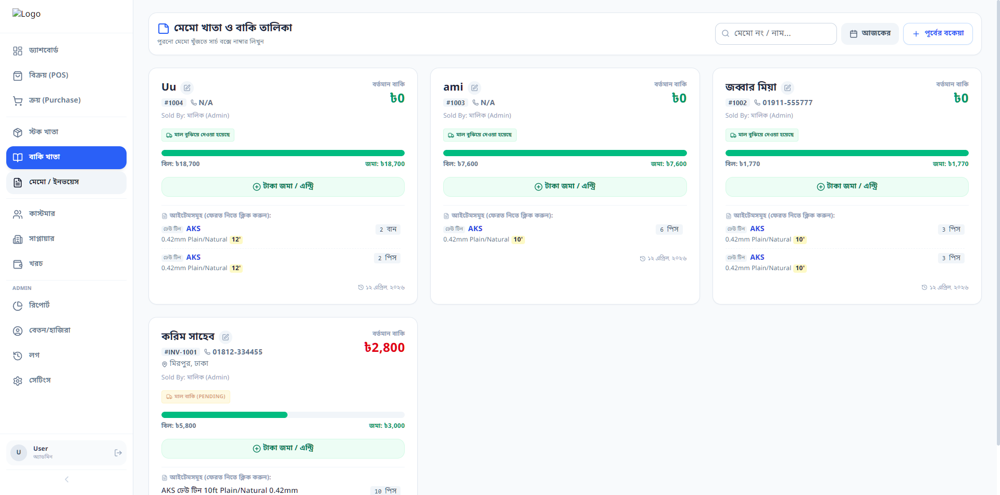
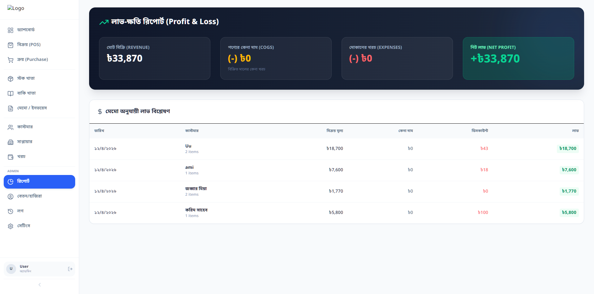
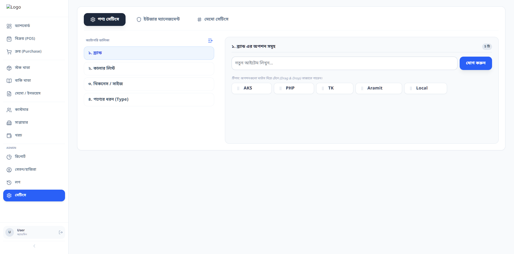

# Tinghor POS — Bengali-first Point of Sale System

Tinghor POS is an open-source point-of-sale, inventory, and ledger management system built for tin/corrugated iron sheet businesses in Bangladesh.

Many small and niche building-material businesses still manage sales, stock, customer dues, purchases, and expenses manually. Tinghor POS aims to provide a simple, affordable, Bengali-first software foundation for those businesses.

## Live Demo

Demo: Coming soon
Screenshots: 
## Screenshots

### Dashboard


### POS Screen


### Inventory


### Customer Ledger


### Reports


### Settings


## Key Features

* POS sales with product search, quantity, and receipt generation
* Inventory management with stock tracking and low-stock alerts
* Customer ledger for credit/debit tracking
* Supplier management and purchase history
* Sales history with filters
* Expense tracking
* Business reports with charts
* Salary management
* Activity logs for audit history
* Admin settings
* Bengali/English language support

## Tech Stack

* Frontend: React, TypeScript, Tailwind CSS
* Database: Supabase PostgreSQL
* Charts: Recharts
* Build Tool: Vite
* Deployment: Netlify

## Why This Project Matters

Tinghor POS focuses on a niche but real business need in Bangladesh: tin and corrugated iron sheet sellers. Many existing POS tools are either too generic, expensive, or not designed for local workflows such as customer ledger, supplier purchases, Bengali interface, and inventory handling for building-material businesses.

This project is designed to become a reusable open-source foundation for small business POS systems in Bangladesh and similar markets.

## Current Status

Tinghor POS is currently in active development. Core modules are already implemented, and the project is being prepared for a stable public release.

## Roadmap

See [ROADMAP.md](./ROADMAP.md) for planned improvements.

## Local Setup

Clone the repository:

```bash
git clone https://github.com/abdulla-al-maruf/tinghor-pos.git
cd tinghor-pos
```

Install dependencies:

```bash
npm install
```

Create a `.env.local` file:

```env
VITE_SUPABASE_URL=your_supabase_project_url
VITE_SUPABASE_ANON_KEY=your_supabase_anon_key
```

Run the development server:

```bash
npm run dev
```

## Security Setup

After setting up Supabase, run the SQL files from the `supabase` folder to enable baseline security policies and database constraints.

Never commit real Supabase keys, private credentials, or production secrets.

## Maintainer

This project is created and maintained by Abdulla Al Maruf Shahin.

I am the primary maintainer of this project and responsible for product direction, code updates, issue triage, releases, documentation, and security improvements.

## Contributing

Contributions, bug reports, ideas, and feedback are welcome.

You can help by:

* Reporting bugs
* Suggesting improvements
* Testing the demo
* Improving documentation
* Helping with Bengali localization
* Reviewing security and database policies

## License

This project is licensed under the MIT License.
